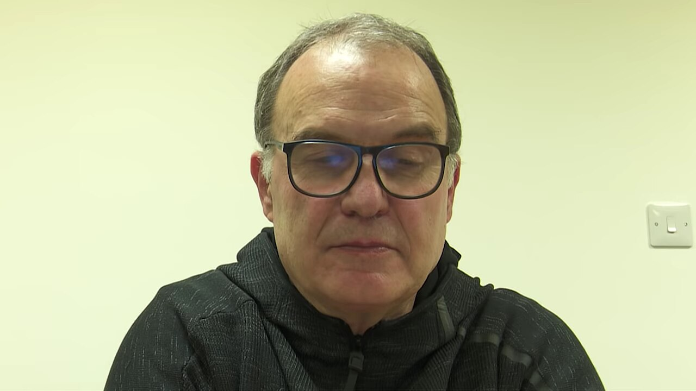
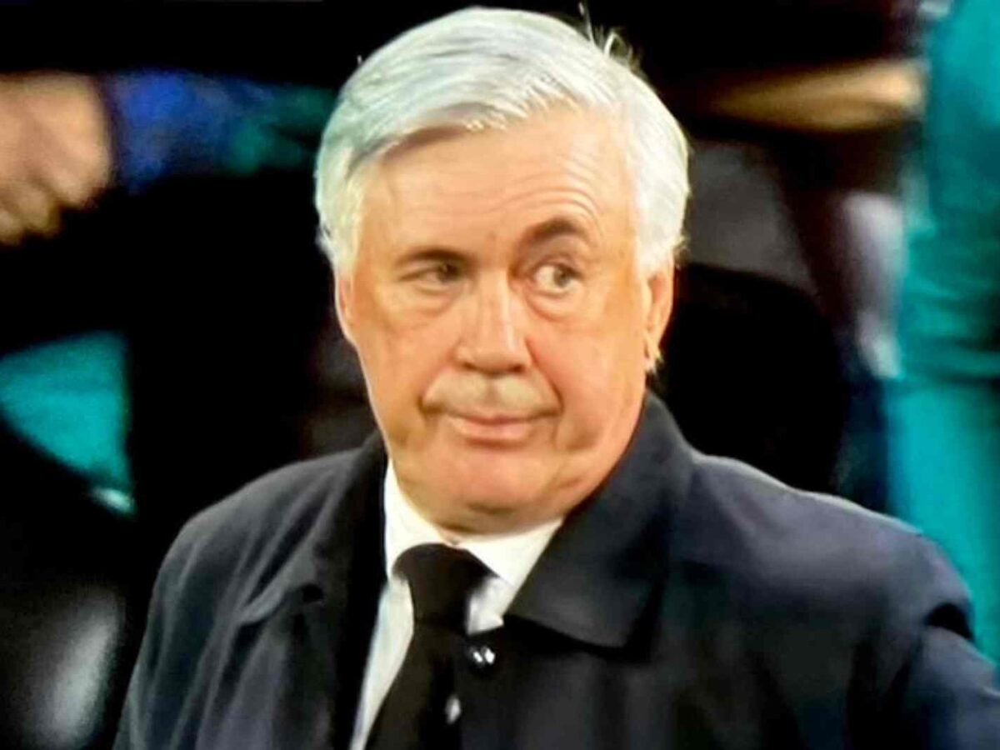
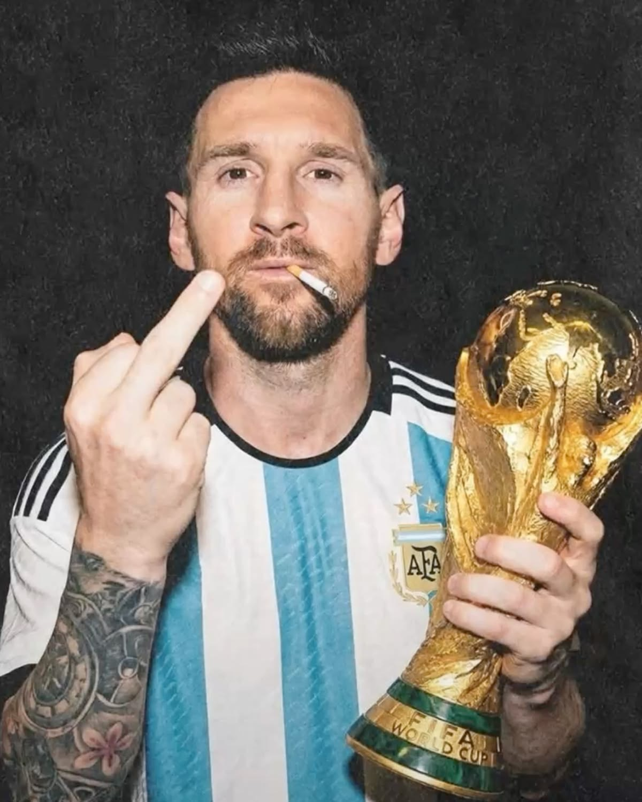
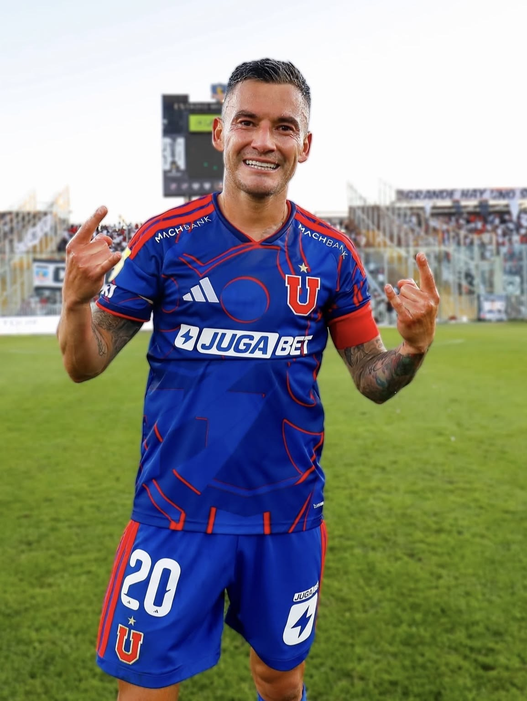
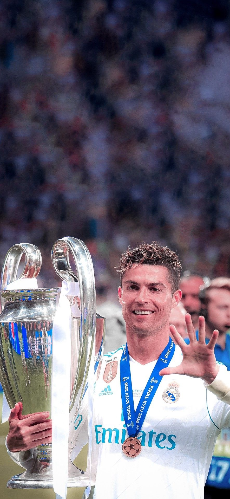
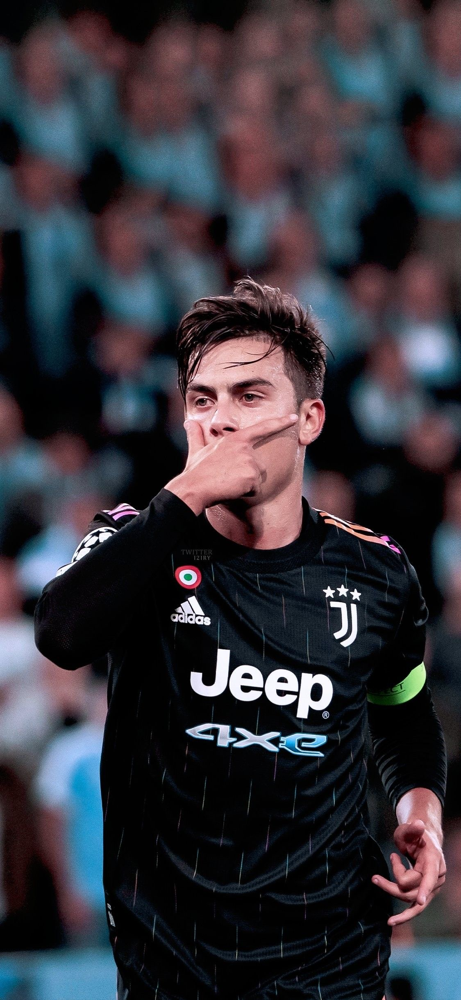
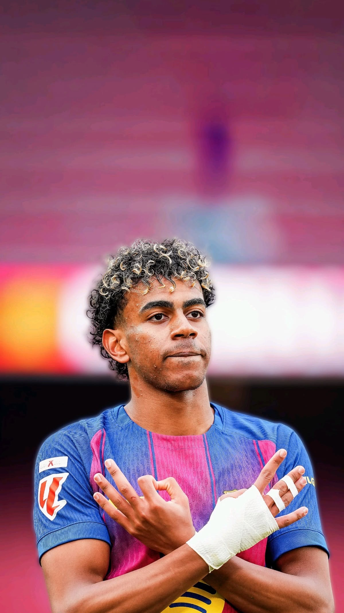
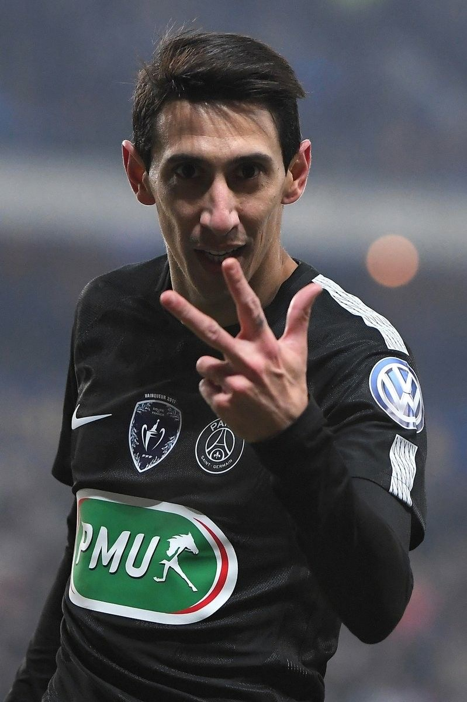
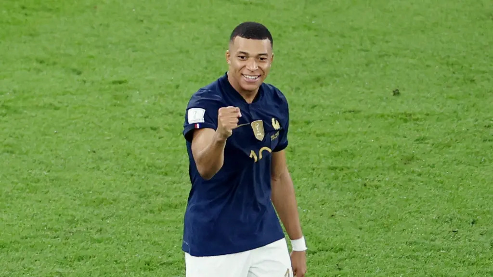
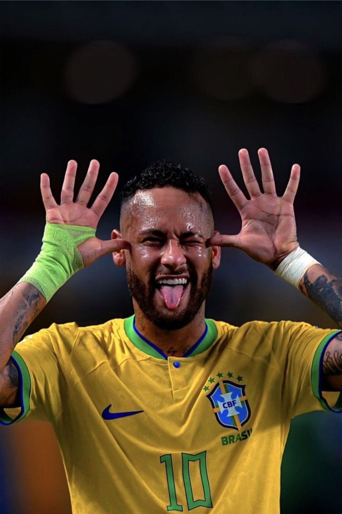

# Identificador de Futbolistas

## tarea-02

- *Carlos Mella*
- *Juan Valenzuela*
  

- Asignatura: Dispositivos Periféricos y Plataformas para la Interacción Digital *DIS9087*

Proyecto de reconocimiento de gestos, utilizando Python y MediaPipe. Realizado tomando como referencia este repositorio:

- <https://github.com/catherpiee/meowmeowcatcam>

## Gestos

| # | Nombre | Cómo se activa | imagen |
| --- | --- | --- | --- |
| 1 | Bielsa| No hacer ningún gesto con las manos y mantener una posición neutral. |  |
| 2 | Ancelotti | Girar la cabeza hacia un lado y mirar de reojo, sin realizar otro gesto específico con las manos.| |
| 3 | Messi | Levantar únicamente el dedo del medio, manteniendo los demás dedos doblados.|  |
| 4 | Charles | Hacer el gesto de la U 🤘, levantando el dedo índice y el meñique mientras los dedos medio y anular permanecen doblados.|  |
| 5 | Cristiano | Mostrar la palma de la mano abierta con los 5 dedos extendidos.|  |
| 6 | Dybala | Cubrir la parte inferior del rostro con una mano, colocando la palma cerca de la boca/nariz. |  |
| 7 | Lamine | Usar las dos manos, mostrando 3 dedos con una mano y 3 o 4 dedos con la otra. No funciona con ambas manos completamente abiertas. |   |
| 8 | Di María | Levantar 3 dedos con una mano. Puede hacerse mostrando pulgar + índice + medio, o índice + medio + anular.|   |
| 9 | Mbappé | Cerrar completamente la mano formando un puño. |  |
| 10 | Neymar | Levantar ambas manos abiertas y colocarlas a los costados de la cabeza, aproximadamente a la altura de las orejas. |   |

- [carpeta de imágenes](./imagenes)

- [video](./)
